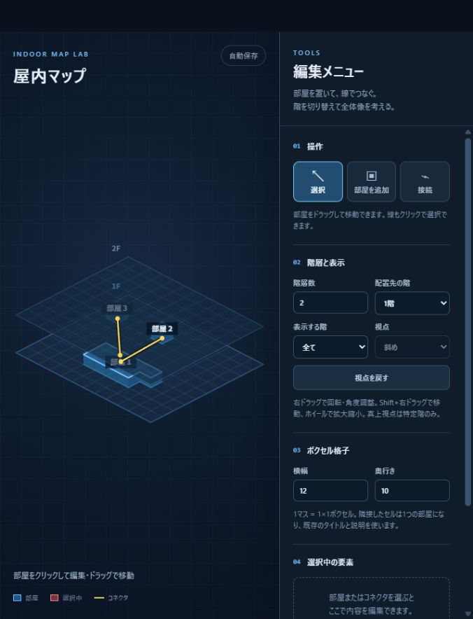
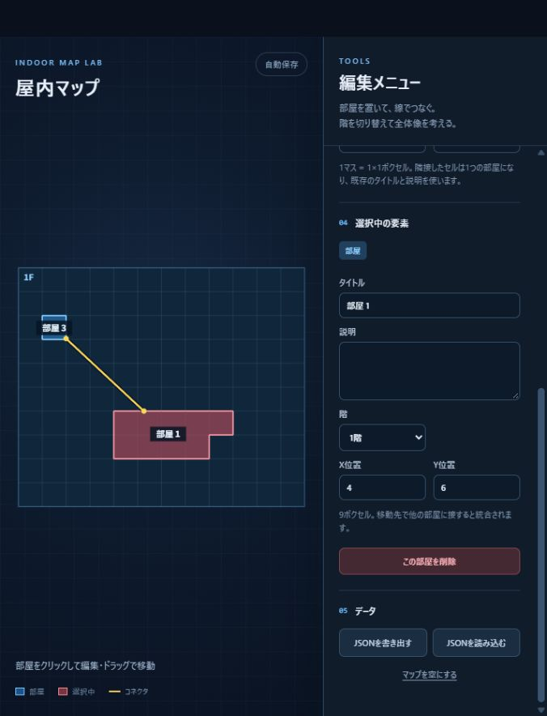
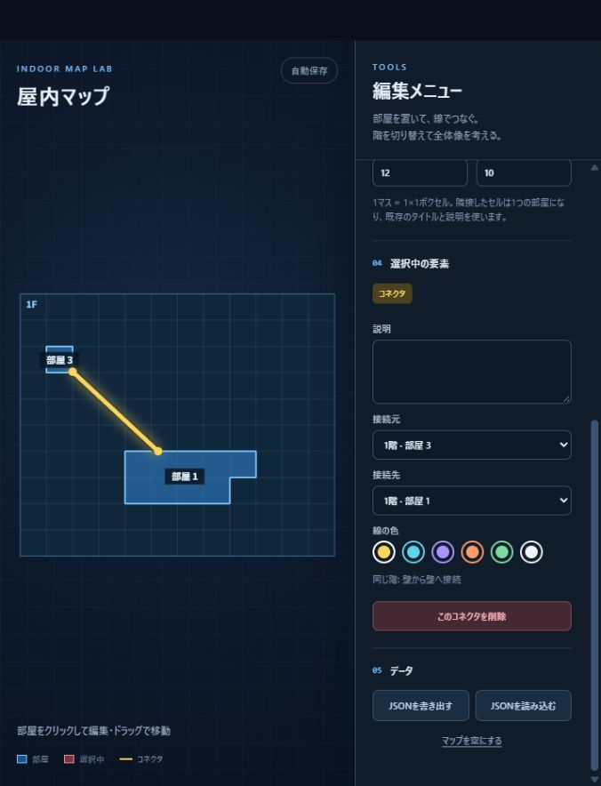
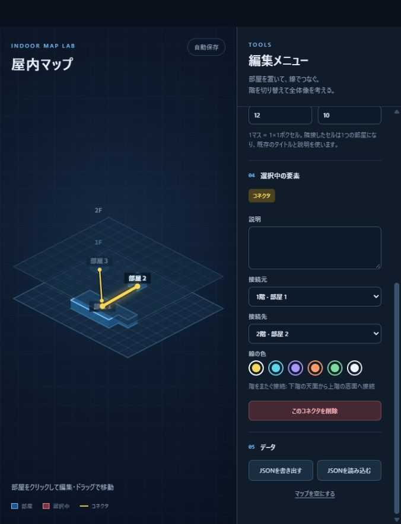

# Indoor Map Lab

3Dゲームの屋内マップを、階ごとのボクセル格子で考えるための小さなツールです。HTML・CSS・JavaScriptだけで動き、外部ライブラリは使っていません。

## 起動

`index.html` をブラウザーで開きます。ローカルサーバーを使う場合は、このフォルダで次を実行して `http://127.0.0.1:8765/` を開いてください。

```powershell
python -m http.server 8765
```

保存データはブラウザーの `localStorage` に入ります。`file://` と `http://127.0.0.1:8765/` は別の保存先になるため、普段使う開き方を決めておくか、JSONを書き出して保管してください。

## 画面例

画面例に写る部屋は操作確認用です。アプリの初期マップには含まれません。

### 全階の斜め表示

各階を重ねて見られます。階をまたぐ線は、下階の部屋の天面から上階の部屋の底面へ接続します。



### 1階の真上表示と連結した部屋

「表示する階」で1階を選ぶと真上視点に切り替えられます。選択中の部屋は半透明の赤になり、タイトル・説明・位置を右側で編集できます。隣接したボクセルの共有枠は描かれません。



### 同じ階の接続

接続線は部屋の中心を通さず、外壁同士を結びます。選択すると色を変えずに太く表示し、右側で説明・接続元・接続先・色を編集できます。



### 階をまたぐ接続

下階の天面と上階の底面を結びます。階を1つだけ表示している間は、他階へ伸びるコネクタは表示されません。確認するには「表示する階」を「全て」にしてください。



## 基本操作

| 操作 | 方法 |
| --- | --- |
| 部屋を作る | 「部屋を追加」を選び、配置先の階の格子をクリック。1回で1×1ボクセルを置きます。 |
| 部屋を連結する | 同じ階の既存部屋に辺で接する位置へボクセルを置くか、部屋を移動します。自動で1つの部屋になります。 |
| 部屋を編集する | 「選択」で部屋をクリック。右側でタイトル・説明・階・X/Y位置を編集します。ドラッグでも移動できます。 |
| コネクタを作る | 「接続」を選び、接続元と接続先の部屋を順にクリックします。初期色は黄色です。 |
| コネクタを編集する | 「選択」で線をクリック。右側で説明・接続する部屋・色を変更します。 |
| 階と視点を切り替える | 「表示する階」で「全て」または特定階を選びます。真上視点は特定階の表示中だけ使えます。 |
| 削除する | 要素を選択して右側の削除ボタン、または `Delete` キーを押します。`Esc` で選択モードに戻ります。 |

連結した部屋には、接していた**既存の部屋のタイトルと説明**が残ります。別々の部屋を連結すると、吸収された側の情報は統合後の編集欄には残りません。削除は部屋全体が対象で、1ボクセルだけを削除する機能はありません。

## 視点操作

| 視点 | 操作 |
| --- | --- |
| 斜め | 右ドラッグで回転・角度調整。`Shift`＋右ドラッグで画面を移動。 |
| 真上 | 右ドラッグで画面を移動。 |
| 共通 | ホイールで拡大・縮小。「視点を戻す」で標準の角度・倍率・位置に戻す。 |

「表示する階」を「全て」に戻すと、視点は必ず斜めになります。

## 保存と制約

- 編集内容はブラウザー内へ自動保存されます。右側からJSONを書き出し・読み込みできます。
- 階層数は1〜30、格子の横幅と奥行きは各4〜30です。部屋が格子外や削除される階に残る設定変更は拒否されます。
- 部屋の移動先が他の部屋と重なる場合は配置できません。辺で接した場合は自動で統合されます。
- 旧形式の保存データは読み込み時に新しいボクセル形式へ変換します。変換前のデータはブラウザー内に一度バックアップします。

## ファイル

| ファイル | 内容 |
| --- | --- |
| `index.html` | 画面の構造 |
| `styles.css` | 配色と右側メニューのレイアウト |
| `app.js` | ボクセル・接続線・視点操作・保存処理 |
| `docs/screenshots/` | このREADMEで使う画面例 |
